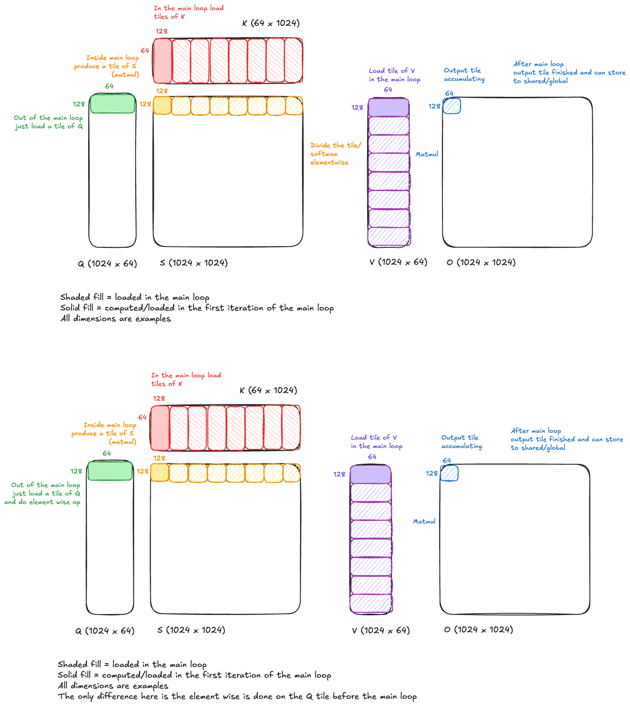

# Attention Kernel Dataflow Optimization with E-graphs

The code uses [egglog](https://github.com/egraphs-good/egglog) (via its Python bindings) to optimize the data movement in a simplified GPU attention kernel. It encodes two equivalent dataflow graphs for tiled attention into an e-graph, connects them with a rewrite rule, and extracts the lower-cost variant using ILP-based DAG extraction.

## Simplified attention modeling

We model attention with these two variants


A simplified mainloop for the first version in pseudo code:

```
# once, before the loop
Load Q tile to SMEM from global

for each K, V tile block:        # loop_iters = seq_len / tile_n
    Load K tile to SMEM
    Load V tile to SMEM
    QK = WGMMA(Q_smem, K_smem)
    A  = scale(QK)               # elementwise: multiply by 1/sqrt(d))
    O += WGMMA(A, V_smem)        # accumulate output

Store O to global memory
```

`scale(QK)` applies a scalar multiply to the matmul result every iteration. But scaling is linear, so we can equivalently scale Q once before the loop. The simplified mainloop for the second version of the attention kernel:

```
Load Q tile to SMEM from global
Q_scaled = scale(LDR(Q_smem))     # load Q to registers, scale once

for each K, V tile block:
    Load K tile to SMEM
    Load V tile to SMEM
    QK = WGMMA(Q_scaled, K_smem)  # Q already in registers, no implicit load
    O += WGMMA(QK, V_smem)

Store O to global memory
```

This saves data movement because:

- In the naive version, WGMMA implicitly loads Q from SMEM to registers every iteration
- In the rearranged version, Q is explicitly loaded to registers once and stays there

The two variants of doing the operations are shown below:



## Default Tile Configuration

The default example models a typical attention tile block:

| Tile | Rows | Cols | Dtype     | Size     | loop_iters      |
| ---- | ---- | ---- | --------- | -------- | --------------- |
| Q    | 128  | 64   | fp16 (2B) | 16,384 B | 1 (loaded once) |
| K    | 64   | 128  | fp16 (2B) | 16,384 B | 8 (streamed)    |
| V    | 128  | 64   | fp16 (2B) | 16,384 B | 8 (streamed)    |

- `d = 64` is the head dimension
- `tile_m = 128` rows of Q processed at once
- `tile_n = 128` columns of K (= rows of V) processed per iteration
- `loop_iters = 8` means `seq_len / tile_n = 1024 / 128 = 8` iterations
- WGMMA output uses fp32 (4 bytes) for accumulation

## How the E-graph finds the optimal path

1. **Encode the naive dataflow** as egglog expressions (LDS, WGMMA, Elementwise, etc.)
2. **Apply the rewrite rule**: `Elementwise(WGMMA(a, b))` => `WGMMA(Elementwise(LDR(a)), b)`. This adds the rearranged variant to the same e-class, so both paths coexist in the e-graph.
3. **Propagate analysis**: Rules fire to compute `rows`, `cols`, `dtype_bytes`, `mem_region`, and `loop_iters` for every e-node.
4. **Assign costs**: `set_cost()` on each e-node records its data movement in bytes, scaled by `loop_iters`.
5. **Extract**: ILP-based DAG extraction picks one e-node per active e-class to minimize total cost. Each e-class is counted once (no double-counting shared subexpressions).

The ILP extractor correctly chooses the rearranged path because the total traffic is lower. The result is visible in the cost-annotated diagram at `output/egraph-costs.svg`, where green nodes are the selected optimal path and gray nodes are the alternatives the extractor did not choose.

## Code organization

```
attention-rewrite/
  attention.py    - DSL types, e-class analysis rules, rewrite rule, egraph construction
  extract.py      - ILP-based DAG extraction with traffic cost model (PuLP/CBC)
  visualize.py    - Graphviz rendering of the egraph (plain + cost-annotated)
  run.py          - Orchestrator: builds egraph, runs ILP, generates diagrams
  output/         - Generated files (egraph.json, egraph.svg, egraph-costs.svg)
```

### attention.py

Defines the properties related to tile operations:

- **MemRegion**: GLOBAL, SHARED, REGISTERS
- **Tile**: input, LDS (global->shared), LDR (shared->registers), WGMMA (matmul), Elementwise (pure compute), STS (registers->shared), STG (shared->global)

Registers e-class analysis rules that propagate tile metadata (dimensions, dtype, memory location, loop iteration count) through operations. The key rewrite rule connects naive and rearranged forms.

`build_egraph(tiles, accum_dtype_bytes)` builds the egraph and returns it along with the root expression. `serialize_egraph()` exports to JSON.

### extract.py

Reads the serialized egraph JSON and computes per-node traffic costs by parsing the analysis property nodes embedded in the graph. Uses PuLP to solve an ILP that selects one e-node per reachable e-class minimizing total data movement.

The result is a "transaction dict" mapping each selected e-class to its traffic cost in bytes. The total cost is the sum of the dict values.

### visualize.py

Builds a filtered Graphviz diagram showing only Tile operation nodes (omitting internal analysis property nodes like `.rows`, `.cols`, etc.). Generates two SVGs:

- `output/egraph.svg`: Clean dataflow diagram showing all e-classes and their alternative e-nodes
- `output/egraph-costs.svg`: Same diagram with per-e-class traffic costs annotated, selected nodes highlighted in green, alternatives grayed out

### run.py

Configures the tile specs and runs the full pipeline. All generated files are written to `output/`.

## Running

```bash
pip install egglog pulp graphviz
python run.py
```

This generates:

- `output/egraph.json` - serialized e-graph
- `output/egraph.svg` - e-graph diagram
- `output/egraph-costs.svg` - e-graph with ILP-selected costs highlighted

## Data transfer calculations

More about the data transfer calculations in the `additional-media/transaction-calcs.md` file.
